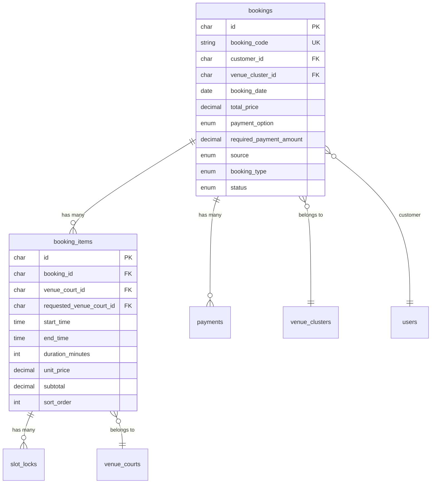

# Tái thiết kế Schema Bookings → Booking + BookingItems

## Bối cảnh

Bảng `bookings` hiện tại lưu **1 sân + 1 khung giờ liên tục** cho mỗi booking. Không hỗ trợ đặt nhiều sân hoặc nhiều khung giờ rời trong cùng 1 đơn.

**Yêu cầu mới:**
- Sân A 1h-2h + Sân B 1h-2h (cùng ngày, khác sân)
- Sân A 1h-2h + Sân A 4h-6h (cùng ngày, cùng sân, khác giờ)

**Giải pháp:** Tách theo mô hình **Order → OrderItems** (giống e-commerce).

---

## User Review Required

> [!IMPORTANT]
> **Ràng buộc cùng ngày + cùng cụm sân:** Plan này giả định tất cả items trong 1 booking phải:
> 1. Cùng **ngày chơi** (`booking_date`)
> 2. Cùng **cụm sân** (`venue_cluster_id`) — vì thanh toán đi về cùng 1 chủ sân
>
> Nếu bạn muốn cho phép đặt **khác ngày** hoặc **khác cụm sân** trong 1 booking, hãy cho tôi biết.

> [!WARNING]
> **Breaking change:** Schema mới sẽ thay đổi cấu trúc API response và request. Frontend BookingForm cần viết lại đáng kể để hỗ trợ thêm/xóa nhiều items.

---

## Open Questions

1. **Giới hạn items?** Một booking tối đa bao nhiêu items? (Đề xuất: 10)
2. **Thanh toán từng phần?** Khi có nhiều items, user vẫn thanh toán 1 lần cho cả booking hay muốn thanh toán riêng từng item?
3. **Hủy từng item?** User có thể hủy 1 item mà giữ lại các items khác trong cùng booking không? Hay hủy = hủy cả booking?

---

## Proposed Changes

### Tổng quan kiến trúc mới



---

### Database Schema

#### [NEW] Migration: `create_booking_items_table`

Bảng mới `booking_items` chứa chi tiết từng sân + khung giờ:

```php
Schema::create('booking_items', function (Blueprint $table) {
    $table->char('id', 36)->primary();

    // --- Liên kết ---
    $table->char('booking_id', 36)
        ->comment('Đơn đặt sân cha.');
    $table->char('venue_court_id', 36)
        ->comment('Sân con thực tế được gán.');
    $table->char('requested_venue_court_id', 36)->nullable()
        ->comment('Sân con khách yêu cầu ban đầu.');

    // --- Thời gian ---
    $table->time('start_time')
        ->comment('Giờ bắt đầu của item.');
    $table->time('end_time')
        ->comment('Giờ kết thúc của item.');
    $table->unsignedInteger('duration_minutes')
        ->comment('Thời lượng tính bằng phút.');

    // --- Giá ---
    $table->decimal('unit_price', 12, 2)->default(0.00)
        ->comment('Đơn giá trung bình/giờ tại thời điểm đặt.');
    $table->decimal('subtotal', 12, 2)->default(0.00)
        ->comment('Thành tiền = (duration/60) * unit_price (hoặc tổng các slot 30 phút).');

    // --- Đổi sân ---
    $table->char('court_changed_by', 36)->nullable()
        ->comment('Người đổi sân.');
    $table->timestamp('court_changed_at')->nullable()
        ->comment('Thời điểm đổi sân.');
    $table->text('court_changed_reason')->nullable()
        ->comment('Lý do đổi sân.');

    // --- Sắp xếp ---
    $table->unsignedInteger('sort_order')->default(0)
        ->comment('Thứ tự hiển thị.');

    $table->timestamps();

    // --- Foreign Keys ---
    $table->foreign('booking_id')
        ->references('id')->on('bookings')->onDelete('cascade');
    $table->foreign('venue_court_id')
        ->references('id')->on('venue_courts')->onDelete('restrict');
    $table->foreign('requested_venue_court_id')
        ->references('id')->on('venue_courts')->onDelete('set null');
    $table->foreign('court_changed_by')
        ->references('id')->on('users')->onDelete('set null');

    // --- Indexes ---
    $table->index(['booking_id', 'sort_order'], 'booking_items_booking_sort_index');
    $table->index(['venue_court_id', 'start_time', 'end_time'], 'booking_items_court_time_index');
});
```

---

#### [MODIFY] Migration: `modify_bookings_table_for_items`

Xóa các cột per-slot khỏi `bookings`, giữ lại cột order-level:

```php
// Bước 1: Migrate dữ liệu cũ sang booking_items (nếu có)
// Bước 2: Xóa các cột không còn cần ở bookings

Schema::table('bookings', function (Blueprint $table) {
    // Xóa foreign keys trước
    $table->dropForeign(['venue_court_id']);
    $table->dropForeign(['requested_venue_court_id']);
    $table->dropForeign(['court_changed_by']);

    // Xóa indexes liên quan
    $table->dropIndex('bookings_availability_index');
    $table->dropIndex('bookings_requested_court_date_index');
    $table->dropIndex('bookings_start_time_index');
    $table->dropIndex('bookings_end_time_index');

    // Xóa các cột đã chuyển sang booking_items
    $table->dropColumn([
        'venue_court_id',
        'requested_venue_court_id',
        'start_time',
        'end_time',
        'duration_minutes',
        'court_changed_by',
        'court_changed_at',
        'court_changed_reason',
    ]);
});
```

**Cột giữ lại trên `bookings` (header đơn hàng):**

| Cột | Vai trò |
|-----|---------|
| `id`, `booking_code` | Định danh |
| `customer_id` | Khách hàng |
| `venue_cluster_id` | Cụm sân (ràng buộc tất cả items cùng cluster) |
| `booking_date` | Ngày chơi (ràng buộc tất cả items cùng ngày) |
| `total_price` | Tổng tiền = SUM(booking_items.subtotal) |
| `payment_option`, `required_payment_amount` | Thanh toán |
| `source`, `booking_type` | Loại booking |
| `recurring_*` fields | Booking cố định |
| `status`, `status_reason` | Trạng thái |
| `walk_in_*` | Khách vãng lai |
| `cancelled_by`, `cancelled_at` | Hủy booking |
| `created_by` | Người tạo |
| `reminder_sent_at` | Nhắc lịch |

---

#### [MODIFY] `slot_locks` table

Thêm reference đến `booking_items`:

```php
Schema::table('slot_locks', function (Blueprint $table) {
    $table->char('booking_item_id', 36)->nullable()->after('booking_id')
        ->comment('Item cụ thể được lock.');
    $table->foreign('booking_item_id')
        ->references('id')->on('booking_items')->onDelete('set null');
});
```

---

### Data Migration Strategy

Migration sẽ tự động chuyển dữ liệu booking cũ sang cấu trúc mới:

```php
// Trong migration, TRƯỚC khi xóa cột:
$bookings = DB::table('bookings')->get();
foreach ($bookings as $booking) {
    DB::table('booking_items')->insert([
        'id' => Str::uuid(),
        'booking_id' => $booking->id,
        'venue_court_id' => $booking->venue_court_id,
        'requested_venue_court_id' => $booking->requested_venue_court_id,
        'start_time' => $booking->start_time,
        'end_time' => $booking->end_time,
        'duration_minutes' => $booking->duration_minutes,
        'unit_price' => $booking->duration_minutes > 0
            ? ($booking->total_price / ($booking->duration_minutes / 60))
            : 0,
        'subtotal' => $booking->total_price,
        'court_changed_by' => $booking->court_changed_by,
        'court_changed_at' => $booking->court_changed_at,
        'court_changed_reason' => $booking->court_changed_reason,
        'sort_order' => 0,
        'created_at' => $booking->created_at,
        'updated_at' => $booking->updated_at,
    ]);
}
```

---

### Backend Code Changes

#### [NEW] [BookingItem.php](file:///c:/Users/Van%20Kien/Downloads/SportGo/app/Models/BookingItem.php)

Model mới cho bảng `booking_items`:
- `booking()` → belongsTo Booking
- `venueCourt()` → belongsTo VenueCourt
- `requestedVenueCourt()` → belongsTo VenueCourt
- `courtChangedBy()` → belongsTo User

---

#### [MODIFY] [Booking.php](file:///c:/Users/Van%20Kien/Downloads/SportGo/app/Models/Booking.php)

- Xóa `venue_court_id`, `requested_venue_court_id`, `start_time`, `end_time`, `duration_minutes`, `court_changed_*` khỏi `$fillable`
- Xóa relationships: `venueCourt()`, `requestedVenueCourt()`, `courtChangedBy()`
- Thêm: `items()` → hasMany BookingItem
- Thêm computed: `totalDurationMinutes()` → sum items

---

#### [MODIFY] [BookingService.php](file:///c:/Users/Van%20Kien/Downloads/SportGo/app/Services/BookingService.php)

`createBooking()` sẽ nhận `items` array thay vì single court+time:

```php
// Input mới:
$data = [
    'booking_date' => '2026-05-30',
    'payment_option' => 'deposit',
    'items' => [
        ['venue_court_id' => 'xxx', 'start_time' => '13:00:00', 'end_time' => '14:00:00'],
        ['venue_court_id' => 'yyy', 'start_time' => '13:00:00', 'end_time' => '14:00:00'],
    ],
];
```

Logic thay đổi:
1. Validate tất cả items cùng `venue_cluster_id`
2. Check availability **cho từng item** riêng
3. Tính `subtotal` cho từng item, `total_price` = SUM(subtotals)
4. Tạo 1 Booking + N BookingItems
5. Tạo N SlotLocks (1 per item) nếu cần thanh toán trước

---

#### [MODIFY] [BookingController.php](file:///c:/Users/Van%20Kien/Downloads/SportGo/app/Http/Controllers/Api/Player/BookingController.php)

- `store()`: validate `items` array thay vì single fields
- `show()`: eager load `items.venueCourt.courtType`
- `checkAvailability()`: hỗ trợ check nhiều items cùng lúc

---

#### [MODIFY] [SepayPaymentService.php](file:///c:/Users/Van%20Kien/Downloads/SportGo/app/Services/Payments/SepayPaymentService.php)

- `handleIpn()`: khi thanh toán thành công, xóa **tất cả** SlotLocks của booking (qua items)
- Không cần thay đổi lớn vì payment vẫn ở level booking

---

### Frontend Changes

#### [MODIFY] [BookingForm.vue](file:///c:/Users/Van%20Kien/Downloads/SportGo/resources/js/views/clients/booking/BookingForm.vue)

- Thêm khả năng chọn **nhiều items** (nhiều sân + khung giờ)
- UI "Thêm lịch" / "Xóa lịch" cho mỗi item
- Tổng tiền = SUM(subtotals) của tất cả items

---

#### [MODIFY] [BookingDetail.vue](file:///c:/Users/Van%20Kien/Downloads/SportGo/resources/js/views/clients/booking/BookingDetail.vue)

- Hiển thị danh sách items thay vì 1 sân + 1 giờ
- Mỗi item hiện: sân con, khung giờ, thành tiền

---

#### [MODIFY] [bookingService.js](file:///c:/Users/Van%20Kien/Downloads/SportGo/resources/js/services/bookingService.js)

- `createBooking()`: gửi `items[]` array thay vì flat fields

---

## So sánh Before / After

| Khía cạnh | Trước (hiện tại) | Sau (mới) |
|-----------|-------------------|-----------|
| Cấu trúc | 1 bảng `bookings` chứa tất cả | `bookings` (header) + `booking_items` (detail) |
| Số sân/booking | 1 | Không giới hạn (cùng cluster) |
| Số khung giờ/booking | 1 liên tục | Nhiều rời nhau |
| Giá | Flat `total_price` | Per-item `subtotal` + tổng `total_price` |
| SlotLock | 1 per booking | 1 per booking_item |
| Payment | Per booking | Per booking (không đổi) |
| Đổi sân | Per booking | Per item |

---

## Verification Plan

### Automated Tests
- Chạy `php artisan migrate` kiểm tra migration không lỗi
- Chạy lại test suite hiện tại: `php artisan test`
- Viết thêm test case cho multi-item booking

### Manual Verification
- Tạo booking 1 item (backward compatible)
- Tạo booking 2 items cùng sân, khác giờ
- Tạo booking 2 items khác sân, cùng giờ
- Kiểm tra thanh toán SePay với multi-item booking
- Kiểm tra hủy booking xóa tất cả slot locks
